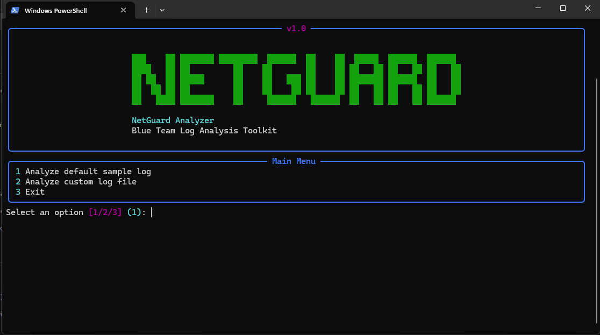

# 🛡️ NetGuard Analyzer

A powerful Blue Team tool for analyzing network logs and detecting suspicious activity using a rich terminal interface.

---

## 📸 Preview



## 🚀 Features

* Detect suspicious IPs based on failed login attempts
* Identify potential port scanning behavior
* Display top active IPs and targeted ports
* Risk level classification (LOW / MEDIUM / HIGH)
* Beautiful terminal UI using Rich
* Export reports to JSON

---

## 📸 Preview

*(Add screenshot here later)*

---

## ⚙️ Usage

```bash
pip install -r requirements.txt
python main.py
```

---

## 📁 Project Structure

```
core/       # parsing & analysis logic
utils/      # UI and helpers
main.py     # entry point
sample.log  # test data
```

---

## 🧪 Example Output

```
Risk Level: HIGH
Suspicious IPs: 2
Port Scan Candidates: 1
```

---

## 🚧 Status

Version 1.0 – actively improving with:

* CLI arguments
* advanced detection rules
* better reporting
* real-world log support

---

## 👨‍💻 Author

Pablo (Webixly)
