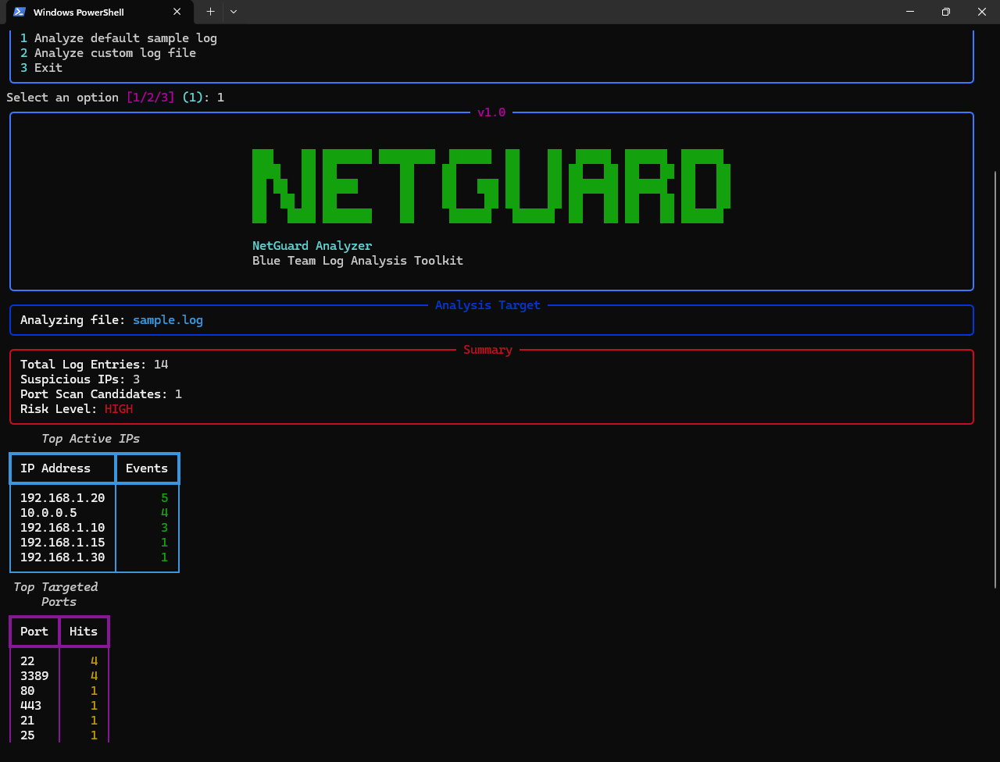
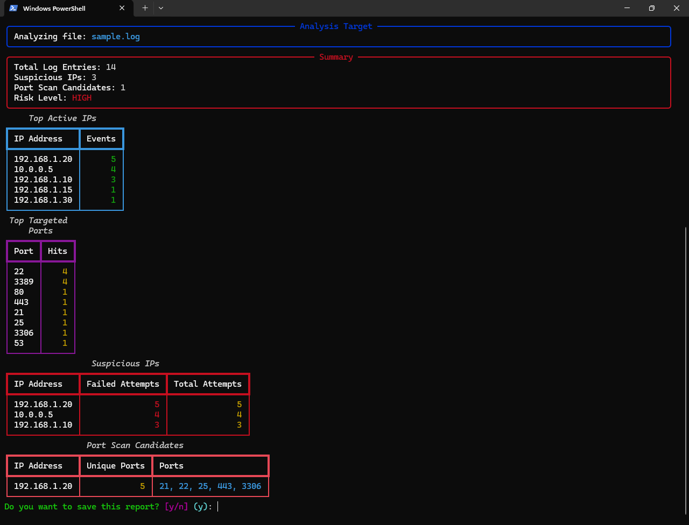

# 🛡️ NetGuard Analyzer

A powerful Blue Team tool for analyzing network logs and detecting suspicious activity using a rich terminal interface.

---

## 🎯 What This Tool Detects

* Brute-force login attempts (repeated failed authentications)
* Port scanning behavior (one IP targeting multiple ports)
* Suspicious activity patterns in network logs

---

## 🧠 How It Works

NetGuard Analyzer processes log files by:

1. Parsing log entries to extract IP addresses, ports, and statuses  
2. Counting repeated failed attempts per IP  
3. Detecting unusual patterns (e.g., multiple ports targeted by a single IP)  
4. Assigning a risk level based on detected behavior  

---

## 🚀 Features

* Detect suspicious IPs based on failed login attempts
* Identify potential port scanning behavior
* Display top active IPs and targeted ports
* Risk level classification (LOW / MEDIUM / HIGH)
* Beautiful terminal UI using Rich
* Export reports to JSON

---

## 🌍 Real-World Use Case

This tool can be used by system administrators and security teams to:

- Analyze server authentication logs
- Detect brute-force attacks in SSH or web services
- Identify suspicious IP behavior in real-time logs
- Investigate potential intrusion attempts
---
## 📸 Preview

### 🔹 Overview



### 🔹 Detailed Analysis



---

## ⚙️ Usage

```bash
pip install -r requirements.txt
python main.py
```

---

## 📁 Project Structure

```
core/       # parsing & analysis logic
utils/      # UI and helpers
main.py     # entry point
sample.log  # test data
```

---

## 🧪 Example Output

```
Risk Level: HIGH
Suspicious IPs: 2
Port Scan Candidates: 1
```

---

## 🧪 Example Scenario

Given a log file containing multiple failed login attempts and unusual port activity, NetGuard Analyzer:

* Identifies the most active IPs
* Flags suspicious behavior
* Detects potential port scans
* Assigns a risk level (LOW / MEDIUM / HIGH)

---

## 🚧 Status

Version 1.0 – actively improving with:

* CLI arguments
* Advanced detection rules
* Better reporting
* Real-world log support

---

## 👨‍💻 Author

Pablo (Webixly)
